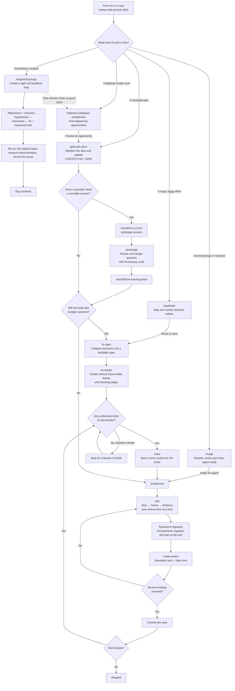
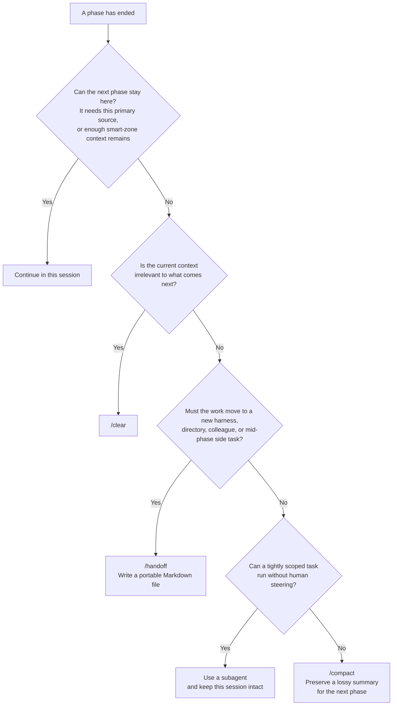

# Engineering skills flowchart

original: https://github.com/mattpocock/skills

Use this as the quick routing map for the engineering skills. The detailed
rules remain in each skill's `SKILL.md`; this page shows how the skills hand
work to one another.

## End-to-end flow

Key constraints:

- Keep grilling, prototyping, specification, and ticket breakdown in one
  unbroken context where possible. Clear only after `/to-tickets`; each ticket
  is then implemented in a fresh context.
- `/wayfinder` produces decisions, not the build. Its normal handoff is
  `/to-spec`, not `/implement`.
- `/triage` is for incoming work. Tickets created by `/to-tickets` are already
  agent-ready and must not be triaged again.
- `/prototype` answers a design question. Its learning feeds the real work; the
  prototype is not production code.
- `/domain-modeling` supplies domain language beneath the flow.
  `/codebase-design` supplies the module, interface, seam, and depth vocabulary
  used by design, TDD, and architecture improvement.

## Phase-boundary decision

Use this tree only between phases. The first **yes** wins.

Mid-phase, keep working in the current session or split a tightly scoped side
task into a subagent. Do not compact merely to tidy the context.

## Standalone and supporting tools

These skills do not form additional required stages in the main pipeline:

| Situation | Skill | How it rejoins the work |
| --- | --- | --- |
| No working directory; the idea still needs sharpening | `/grill-me` | Produces understanding, but no repo documentation |
| A factual gap needs primary-source investigation | `/research` | Feed the cited findings into `/grill-with-docs` |
| Required knowledge lives with another person | `/to-questionnaire` | Feed their answers into `/grill-with-docs` or `/to-spec` |
| Only a human can complete setup or dashboard steps | `/wizard` | The generated script guides the human, then implementation resumes |
| A merge or rebase already has conflicts | `/resolving-merge-conflicts` | Resolve each hunk by intent and finish the Git operation |
| A concrete behaviour is already clear | `/tdd` | Run the red-green-refactor loop directly |
| A branch or PR only needs review | `/code-review` | Review from a fixed point on Standards and Spec axes |
